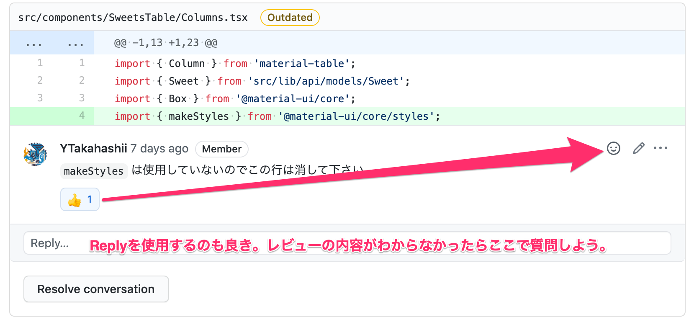

# git/GitHub を使用した開発の流れ

開発は大体以下の流れで進みます。

0. git をバージョン 2.23.0 以降に更新する
1. master ブランチを最新の状態に更新して、ブランチを作成する
2. 実装して、適切にコミットする
3. push する
4. GitHub 上でプルリクエストを作成する
5. レビューをする/もらう
6. レビューをもとに修正する
7. 再レビューをする/もらう
8. master にマージする

それぞれのフェーズについて詳しく見ていきます。

## 0. git をバージョン 2.23.0 以降に更新する

:video_game: コマンド(MacOS)

```.shell
$ brew install git # brew で既に gitをインストールしている場合はスキップ
$ brew upgrade git
$ git --version
$ > git version 2.28.0
```

## 1. master ブランチを最新の状態に更新して、ブランチを作成する

- ブランチを作成するときは[Branch 運用](./BRANCH.md)を参照して下さい。

:video_game: コマンド

```.shell
$ git switch master
$ git pull origin master
$ git switch -c 1_good-first-issue
```

## 2. 実装して適切にコミットする

- 実装します。
- [コミットプレフィックス]()に従って、コミットします。

:video_game: コマンド

```.shell
$ git add <コミットするファイルのパス（スペース区切りで複数指定可能）>
$ git commit -m "feat: 商品テーブルの日本語化"
```

## 3. push する

:video_game: コマンド

```.shell
$ git push -u origin <ブランチ名>
```

## 4. GitHub 上でプルリクエストを作成する

https://github.com/fun-dev/hakodate-sweets-management-web/pulls から PR を作成する

PR の本文はテンプレートに従う

PR 作成後に、GitHub 上のコメントで、レビュー担当者にメンションを当ててレビューを依頼する


右タブの Reviwer と Asignee を設定する


## 5. レビューをする/もらう

レビュー担当者は GitHub のコードレビュー機能を使ってレビューを行う


レビュイーはコメントを貰ったら何らかのリアクション（GitHub のリアクション/リプライ, Slack の GitHub チャンネルに流れたメッセージにリアクション）で反応する（見落としているのかを明らかにするため）



## 6. レビューをもとに修正する

- 修正の変更を加えたら同じブランチに重ねてコミットする
- 修正コミットを重ねたら、再び push する

:video_game: コマンド

```.shell
$ git add <修正したファイルのパス>
$ git commit -m "fix: 〇〇を××に変更"
```

## 7. 再レビューをする/もらう

GitHub のコメントでレビュー担当者に修正した旨を伝える


加えて、右タブの Reviewer 項目でレビュー担当者に再レビューを依頼するボタンを押す


## 8. master にマージする

- master ブランチとコンフリクトしている場合は`git rebase`して解決する
- わからない場合は分かる人に助けてもらう
